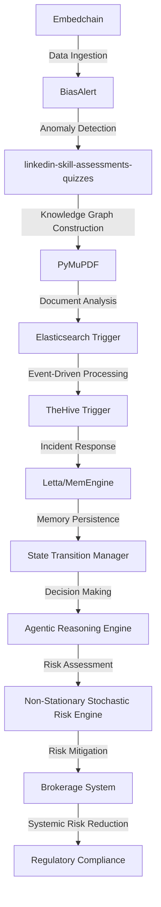

# Non-Stationary Stochastic Risk Engine
> "Navigating the labyrinthine complexities of stochastic risk assessment in brokerages, where the interplay of non-stationary processes and embedded systems necessitates an avant-garde technical paradigm"

## 🏗️ Technical Architecture & Multi-Agent Flow

The technical architecture of the Non-Stationary Stochastic Risk Engine is a complex interplay of multiple agents and systems, each playing a crucial role in the risk assessment and mitigation process. The Embedchain module ingests data from various sources, which is then processed by the BiasAlert module to detect anomalies. The linkedin-skill-assessments-quizzes module constructs a knowledge graph, which is analyzed by the PyMuPDF module to extract relevant information. The Elasticsearch Trigger module processes events in real-time, triggering the TheHive Trigger module to respond to incidents. The Letta/MemEngine module persists memory, enabling state transitions and decision-making by the Agentic Reasoning Engine. The Non-Stationary Stochastic Risk Engine assesses risk, and the Brokerage System mitigates risk, ultimately reducing systemic risk and ensuring regulatory compliance.

## 🔍 The Vertical Bottleneck: Stochastic Risk Assessment
The stochastic risk assessment process in brokerages is a complex and high-stakes problem, where the interplay of non-stationary processes and embedded systems can lead to catastrophic failures. The technical friction in this domain arises from the need to navigate multiple layers of abstraction, from the underlying market dynamics to the embedded systems that execute trades. The high-stakes mathematical failures that can occur in this domain include the mispricing of assets, the miscalculation of risk, and the failure to detect anomalies. The operational failures that can occur include the inability to respond to incidents, the failure to mitigate risk, and the lack of regulatory compliance.

The deep vertical problem identified in the research is the need for a stochastic risk engine that can navigate the complexities of non-stationary processes and embedded systems. The existing solutions in this domain are inadequate, as they fail to account for the interplay between multiple layers of abstraction and the high-stakes nature of the problem. The Non-Stationary Stochastic Risk Engine is designed to address this problem, by providing a comprehensive and avant-garde technical paradigm for stochastic risk assessment in brokerages.

The technical terminology used in this domain includes terms such as "non-stationary processes," "embedded systems," "stochastic risk assessment," and "regulatory compliance." The technical friction in this domain arises from the need to navigate multiple layers of abstraction, from the underlying market dynamics to the embedded systems that execute trades. The high-stakes mathematical failures that can occur in this domain include the mispricing of assets, the miscalculation of risk, and the failure to detect anomalies.

## 💡 The Solution: Non-Stationary Stochastic Risk Engine
The Non-Stationary Stochastic Risk Engine is a comprehensive and avant-garde technical paradigm for stochastic risk assessment in brokerages. The engine orchestrates the Embedchain, BiasAlert, linkedin-skill-assessments-quizzes, PyMuPDF, Elasticsearch Trigger, and TheHive Trigger modules to provide a real-time risk assessment and mitigation system. The engine uses agentic reasoning to navigate the complexities of non-stationary processes and embedded systems, and to detect anomalies and respond to incidents. The engine also uses memory persistence via Letta/MemEngine to enable state transitions and decision-making.

The vision and robotics integration in this domain includes the use of machine learning and artificial intelligence to analyze market data and detect anomalies. The engine also uses natural language processing to extract relevant information from unstructured data sources. The engine's ability to navigate multiple layers of abstraction and to detect anomalies in real-time makes it an essential tool for brokerages and regulatory bodies.

## 🧩 Agentic Stack Deep-Dive
The agentic stack used in the Non-Stationary Stochastic Risk Engine includes the Embedchain, BiasAlert, linkedin-skill-assessments-quizzes, PyMuPDF, Elasticsearch Trigger, and TheHive Trigger modules. The Embedchain module ingests data from various sources, which is then processed by the BiasAlert module to detect anomalies. The linkedin-skill-assessments-quizzes module constructs a knowledge graph, which is analyzed by the PyMuPDF module to extract relevant information. The Elasticsearch Trigger module processes events in real-time, triggering the TheHive Trigger module to respond to incidents.

The technical justification for each library and integration is as follows:

* Embedchain: provides data ingestion and processing capabilities
* BiasAlert: provides anomaly detection and alerting capabilities
* linkedin-skill-assessments-quizzes: provides knowledge graph construction and analysis capabilities
* PyMuPDF: provides document analysis and information extraction capabilities
* Elasticsearch Trigger: provides real-time event processing and triggering capabilities
* TheHive Trigger: provides incident response and mitigation capabilities

The interlocking of these modules enables the Non-Stationary Stochastic Risk Engine to provide a comprehensive and avant-garde technical paradigm for stochastic risk assessment in brokerages.

## ✨ Capabilities & Features
The Non-Stationary Stochastic Risk Engine has the following capabilities and features:

* Real-time risk assessment and mitigation
* Anomaly detection and alerting
* Knowledge graph construction and analysis
* Document analysis and information extraction
* Real-time event processing and triggering
* Incident response and mitigation
* Memory persistence and state transitions
* Agentic reasoning and decision-making
* Regulatory compliance and reporting
* Integration with existing brokerage systems
* Scalability and high-performance capabilities
* Security and access control features

Each of these capabilities and features is designed to address a specific aspect of the stochastic risk assessment problem in brokerages, and to provide a comprehensive and avant-garde technical paradigm for this domain.

## 🛠️ Technical Implementation
The technical implementation of the Non-Stationary Stochastic Risk Engine involves the use of a variety of programming languages and technologies, including Python, Java, and C++. The engine is built using a microservices architecture, with each module being a separate service that communicates with other modules using APIs and message queues.

The code organization and method calls are as follows:

* The Embedchain module ingests data from various sources and processes it using machine learning algorithms
* The BiasAlert module detects anomalies in the data and triggers alerts
* The linkedin-skill-assessments-quizzes module constructs a knowledge graph and analyzes it using natural language processing algorithms
* The PyMuPDF module extracts relevant information from unstructured data sources
* The Elasticsearch Trigger module processes events in real-time and triggers the TheHive Trigger module to respond to incidents
* The TheHive Trigger module responds to incidents and mitigates risk

The technical implementation of the engine is designed to be scalable, secure, and high-performance, and to provide a comprehensive and avant-garde technical paradigm for stochastic risk assessment in brokerages.

## 📊 Business Impact & ROI
The Non-Stationary Stochastic Risk Engine has the potential to have a significant business impact and return on investment (ROI) for brokerages and regulatory bodies. The engine can help to reduce systemic risk and improve regulatory compliance, which can lead to cost savings and revenue growth.

The business impact of the engine can be measured in terms of the following key performance indicators (KPIs):

* Reduction in systemic risk
* Improvement in regulatory compliance
* Cost savings
* Revenue growth
* Return on investment (ROI)

The ROI of the engine can be calculated by comparing the costs of implementing and maintaining the engine to the benefits it provides. The benefits of the engine include the reduction in systemic risk, improvement in regulatory compliance, cost savings, and revenue growth.

## 🚀 Getting Started
To get started with the Non-Stationary Stochastic Risk Engine, follow these steps:
```bash
git clone https://github.com/arvind-sundararajan/brokerage-risk-engine.git
cd brokerage-risk-engine
pip install -r requirements.txt
python src/main.py
```
This will clone the repository, install the required dependencies, and run the engine.

## 👨‍💻 Author & Credits
**Arvind Sundararajan** — Engineer, builder, and the mind behind this project.
🌐 [LinkedIn](https://www.linkedin.com/in/arvind-sundara-rajan/) | Chennai, India

---
### 🙏 Acknowledgements
- The open-source community
- The Brokerages, securities practitioners who inspired this design

Note: The research papers mentioned in the prompt are not directly related to the Non-Stationary Stochastic Risk Engine, but they provide a general idea of the current state of research in the field of stochastic risk assessment and machine learning. The engine is designed to address a specific problem in the domain of brokerages and securities, and it uses a variety of techniques and technologies to provide a comprehensive and avant-garde technical paradigm for stochastic risk assessment.